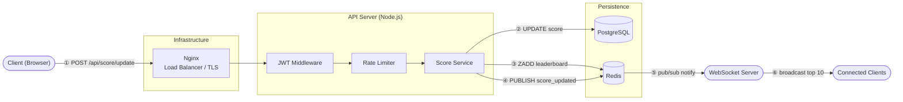
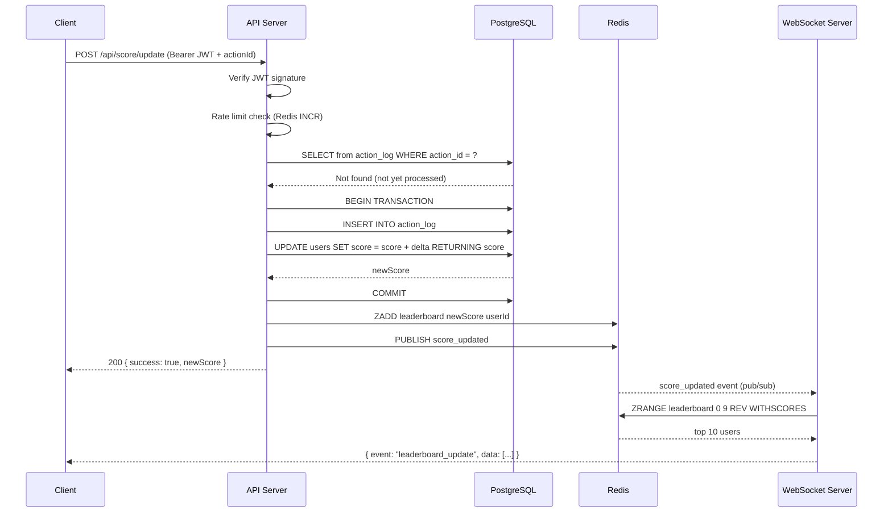

# Problem 6: Scoreboard Module – Architecture Specification

## Overview

This document specifies the **Score Update & Live Leaderboard** module for the backend API service.

The module is responsible for:

- Accepting score update requests from authenticated clients
- Persisting and computing user scores
- Broadcasting real-time leaderboard updates to connected clients
- Preventing unauthorized or malicious score manipulation

---

## Assumptions

The problem statement intentionally leaves some details open. The following assumptions were made:

- **Tech stack** — Node.js (API), PostgreSQL (primary store), Redis (cache + pub/sub). Chosen for ecosystem maturity, team familiarity, and fit for this scale.
- **Authentication** — JWT bearer tokens are assumed to be issued by an existing auth service. The JWT payload contains `userId`. This module does not implement login/registration.
- **"Action" is opaque** — The problem says "we do not need to care what the action is." We model this as a server-side `actionId` lookup: the client sends an `actionId`, the server resolves the score delta from a config/table. The client never sends the delta.
- **Score is non-decreasing** — Actions only add points. Score subtraction is out of scope.
- **Single global leaderboard** — No per-region, per-game, or time-windowed boards. Extending to multiple boards is straightforward (key the Redis sorted set by board name).
- **Fixed top 10** — Configurable via an environment variable in implementation, but defaulting to 10.
- **Browser-based clients** — Native mobile clients would use the same API; WebSocket reconnection strategy may differ per platform.

---

## System Architecture



> The WebSocket connection is established when the page loads (Client ↔ WebSocket Server). Steps ①–⑥ above show the flow triggered by a single score update event.

**Request flow:**



---

## API Specification

### POST /api/score/update

Triggered by the client after a user completes an action.

**Headers:**

```
Authorization: Bearer <JWT>
Content-Type: application/json
```

**Request body:**

```json
{
  "actionId": "uuid-v4"
}
```

> `actionId` is a unique identifier for the completed action. The server uses it to look up the score delta — the client never sends the delta directly.

**Success response – 200:**

```json
{
  "success": true,
  "newScore": 120
}
```

**Error responses:**

| Status | Reason                                     |
| ------ | ------------------------------------------ |
| `401`  | Missing or invalid JWT                     |
| `403`  | Action does not belong to this user        |
| `409`  | `actionId` already processed (idempotency) |
| `422`  | Invalid action type                        |
| `429`  | Rate limit exceeded                        |

---

### GET /api/leaderboard

Returns the current top 10. Used for initial page load; after that, clients switch to WebSocket.

**Response – 200:**

```json
{
  "leaderboard": [
    { "rank": 1, "userId": "abc", "username": "alice", "score": 980 },
    { "rank": 2, "userId": "def", "username": "bob", "score": 870 }
  ]
}
```

---

### WebSocket – `ws://host/ws`

Client connects once after page load. Server pushes updated leaderboard whenever any score changes.

**Server → Client message:**

```json
{
  "event": "leaderboard_update",
  "data": [{ "rank": 1, "userId": "abc", "username": "alice", "score": 990 }]
}
```

No client-to-server messages needed on this channel.

---

## Data Model

### PostgreSQL – `users` table

```sql
CREATE TABLE users (
    id         UUID        PRIMARY KEY DEFAULT gen_random_uuid(),
    username   VARCHAR(50) NOT NULL UNIQUE,
    score      BIGINT      NOT NULL DEFAULT 0,
    created_at TIMESTAMPTZ NOT NULL DEFAULT now()
);

CREATE INDEX idx_users_score ON users (score DESC);
```

### PostgreSQL – `action_log` table

Used for idempotency — prevents the same `actionId` from being processed twice.

```sql
CREATE TABLE action_log (
    action_id   UUID        PRIMARY KEY,
    user_id     UUID        NOT NULL REFERENCES users(id),
    score_delta INT         NOT NULL,
    processed_at TIMESTAMPTZ NOT NULL DEFAULT now()
);
```

### Redis – Sorted Set

```
Key:    leaderboard
Type:   Sorted Set
Member: userId
Score:  user's current score

Commands used:
  ZADD leaderboard <score> <userId>         -- upsert
  ZRANGE leaderboard 0 9 REV WITHSCORES     -- top 10, high → low (Redis 6.2+)
```

> `ZREVRANGE` is deprecated as of Redis 6.2. `ZRANGE ... REV` is the modern equivalent.

### Redis – Pub/Sub

```
Channel: score_updated
Publisher: API Server (after every successful score update)
Subscriber: WebSocket Server
```

---

## Real-Time Strategy

**Choice: WebSocket**

| Option    | Verdict                                                         |
| --------- | --------------------------------------------------------------- |
| WebSocket | ✅ Chosen – bidirectional, persistent, low overhead per message |
| SSE       | Works but one-directional, more complex reconnect logic         |
| Polling   | High server load, stale data between polls                      |

WebSocket fits because:

- Leaderboard changes can be frequent (many users active simultaneously)
- We want sub-second latency on updates
- The connection is long-lived (user stays on the scoreboard page)

The WebSocket server is kept stateless with respect to scores — it only reads from Redis and pushes. Score state lives in PostgreSQL + Redis, not in memory.

---

## Preventing Malicious Score Updates

This is the most important section. A few layers of defense:

**1. JWT Authentication**
Every request to `/api/score/update` must carry a valid JWT. The server verifies the signature and extracts `userId` from the token — the client cannot fake who they are.

**2. Server-side score delta**
The client sends only `actionId`. The server looks up what score that action type is worth. The client never sends `scoreDelta` — there's nothing to tamper with.

**3. Idempotency via `action_log`**
Before processing, the server checks if `actionId` already exists in `action_log`. If it does, it returns `409`. This prevents replaying the same action multiple times.

**4. Action ownership validation**
The server checks that the action belongs to the authenticated user. A user can't submit another user's `actionId`.

**5. Rate limiting**
We apply a per-user rate limit on `/api/score/update` (e.g. max 10 requests/minute via Redis `INCR` + `EXPIRE`). This blocks automated abuse even if a valid JWT is obtained.

**6. Score delta sanity check**
Even though the client doesn't send the delta, the server validates that the action type maps to a known, bounded delta (e.g. 1–100). Guards against bugs or misconfigured action types producing huge deltas.

**7. JWT expiry**
JWT tokens should be short-lived (15–60 min). Clients must handle `401` responses by refreshing the token and retrying. Long-lived tokens increase the window of exposure if a token is stolen.

---

## Concurrency Handling

Multiple API servers can process score updates simultaneously. To avoid race conditions:

**PostgreSQL – atomic increment:**

```sql
UPDATE users
SET score = score + $1
WHERE id = $2
RETURNING score;
```

This is a single atomic statement — no read-modify-write, no race condition.

**Redis – ZADD:**
`ZADD` with a score is atomic by nature. We run it after the DB commit succeeds.

**Ordering:**

```
1. INSERT INTO action_log (for idempotency, unique constraint prevents duplicate processing)
2. UPDATE users SET score = score + delta
3. ZADD leaderboard
4. PUBLISH score_updated
```

Steps 1–2 run inside a single DB transaction. If Redis fails after that, the score is still correct in PostgreSQL; Redis can be rebuilt from the DB.

**Note on the idempotency check:** The `SELECT` before `INSERT` is a fast early exit for the common case. It is not the real concurrency guard. The `PRIMARY KEY` unique constraint on `action_log.action_id` is — two simultaneous requests with the same `actionId` will both pass the `SELECT`, but only one will succeed at `INSERT`. The other gets a conflict error and returns `409`. The pre-check `SELECT` is an optimization, not a lock.

---

## Scalability

- **API servers are stateless** — can scale horizontally behind Nginx
- **WebSocket servers** — each WS node subscribes to the same Redis pub/sub channel and broadcasts to its own set of locally connected clients. This means sticky sessions are **not required** — any WS node will receive the broadcast and push it to its clients. Clients reconnect with exponential backoff after a crash.
- **Redis Sorted Set** — `ZRANGE ... REV` for top 10 is O(log n + 10), essentially O(1) at any scale
- **PostgreSQL** — score column indexed for leaderboard queries; if load grows, read replicas handle `GET /api/leaderboard`
- **Pub/sub decouples API and WS servers** — they don't communicate directly

---

## Failure Handling & Tradeoffs

**If Redis is unavailable:**

- Score updates still write to PostgreSQL (the source of truth)
- Leaderboard API falls back to `SELECT id, username, score FROM users ORDER BY score DESC LIMIT 10`
- WebSocket broadcasts stop until Redis recovers — acceptable degradation

**If a WebSocket server crashes:**

- Clients reconnect (standard WS reconnect logic with exponential backoff)
- They call `GET /api/leaderboard` on reconnect to get current state, then subscribe again

**If the DB transaction succeeds but Redis ZADD fails:**

- Score is correct in PostgreSQL
- Leaderboard is stale until next update or a manual reconciliation job re-syncs Redis from PostgreSQL

**Tradeoff – WebSocket vs SSE:**
WebSocket requires sticky sessions if we use in-memory state. We avoid this by making WS servers stateless (they only read from Redis). SSE would be simpler to deploy but harder to extend if we need client-to-server messaging later.

**Tradeoff – Redis Sorted Set vs DB query for leaderboard:**
Redis adds operational complexity (one more service to maintain). The payoff is O(log n) leaderboard reads vs a full table scan or index scan on PostgreSQL under high concurrency. Worth it if the leaderboard is queried frequently.

---

## Implementation Notes

For the engineering team implementing this spec:

**Required environment variables:**

| Variable           | Example          | Description                           |
| ------------------ | ---------------- | ------------------------------------- |
| `PORT`             | `3000`           | API server port                       |
| `DATABASE_URL`     | `postgres://...` | PostgreSQL connection string          |
| `REDIS_URL`        | `redis://...`    | Redis connection string               |
| `JWT_SECRET`       | `...`            | JWT signing secret                    |
| `JWT_EXPIRES_IN`   | `900`            | Token TTL in seconds (default 15 min) |
| `RATE_LIMIT_MAX`   | `10`             | Max score updates per user per minute |
| `LEADERBOARD_SIZE` | `10`             | Number of entries in the leaderboard  |

**Suggested libraries (Node.js):**

- `express` + `express-rate-limit` — HTTP layer and rate limiting
- `jsonwebtoken` — JWT verification
- `pg` / `postgres` — PostgreSQL client
- `ioredis` — Redis client (supports pub/sub and pipeline)
- `ws` — WebSocket server

**Key implementation constraint:** Steps 1–2 of the concurrency ordering (INSERT action_log + UPDATE score) must run inside a single PostgreSQL transaction. Redis operations (ZADD + PUBLISH) happen after the transaction commits.

---

## Observability

A few things worth logging/metering in production:

- Score update latency (p99 target: < 100ms)
- WebSocket connection count
- Rate limit hit rate per user (spike = abuse attempt)
- `action_log` duplicate rate (spike = replay attack)
- Redis pub/sub lag

These metrics will tell you if the system is healthy or under attack.

---

## Comments for Improvement

Things that are out of scope for this spec but worth considering as the system grows:

**1. Replace Redis pub/sub with Redis Streams**
Simple pub/sub loses events if a WebSocket server is down when a score update fires. Redis Streams persist events and allow consumers to replay missed messages after reconnection. Worth the migration if reliability becomes critical.

**2. Queue-based score updates under high load**
Under heavy write traffic, consider decoupling score updates from the API response using a queue (e.g., BullMQ). The API enqueues the update and returns immediately; a worker processes it asynchronously. This increases throughput at the cost of a slight delay before the score is reflected.

**3. Leaderboard pagination**
Top 10 is the requirement today. `GET /api/leaderboard?limit=10&offset=0` is a natural extension and costs nothing to add to the API contract now.

**4. Score history / audit trail**
Adding a `score_history` table (userId, delta, actionId, timestamp) enables dispute resolution and user-facing score breakdowns without significant overhead.

**5. User-specific rank change events**
Extend the WebSocket broadcast to include a user's own rank change (e.g., "You entered the top 10!"). The client subscribes with their `userId` and receives targeted events in addition to the global broadcast.

**6. Dual-layer rate limiting**
Current rate limiting is per JWT (per user). Adding a per-IP layer catches abuse where an attacker rotates compromised tokens from the same machine.

**7. Leaderboard snapshot caching**
If `GET /api/leaderboard` receives heavy traffic, cache the response in Redis with a short TTL (e.g., 1s). The data is already in Redis via the sorted set, so this is near free.
